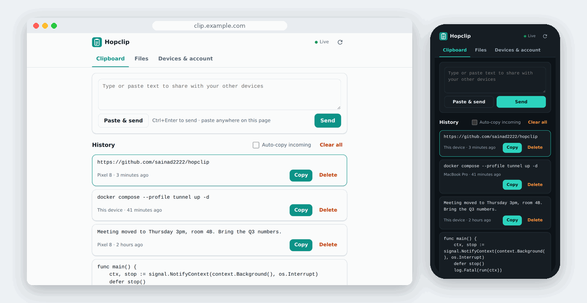
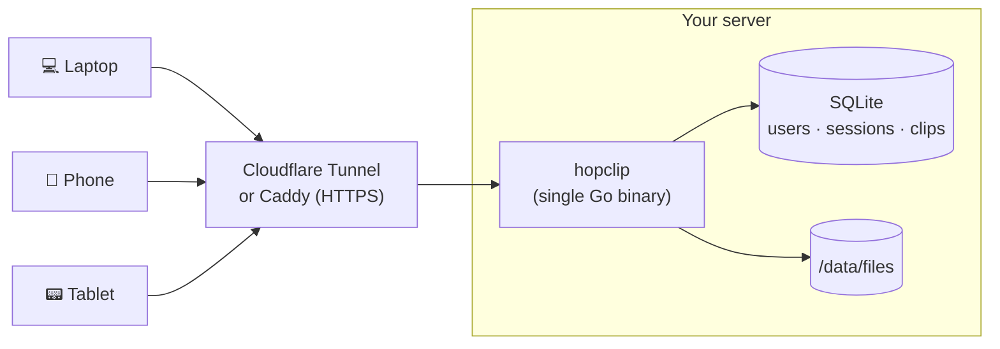
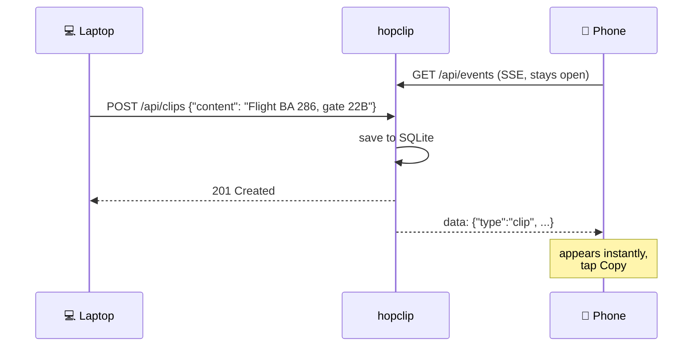
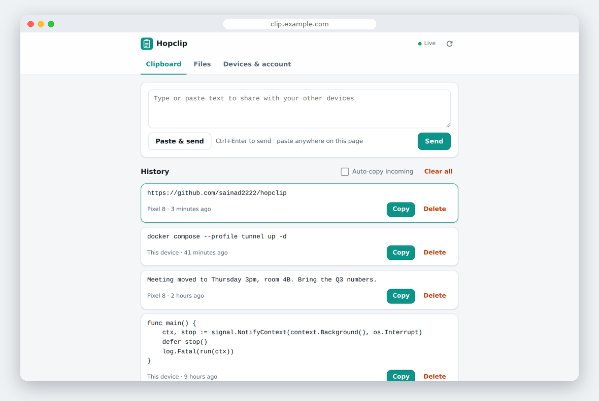
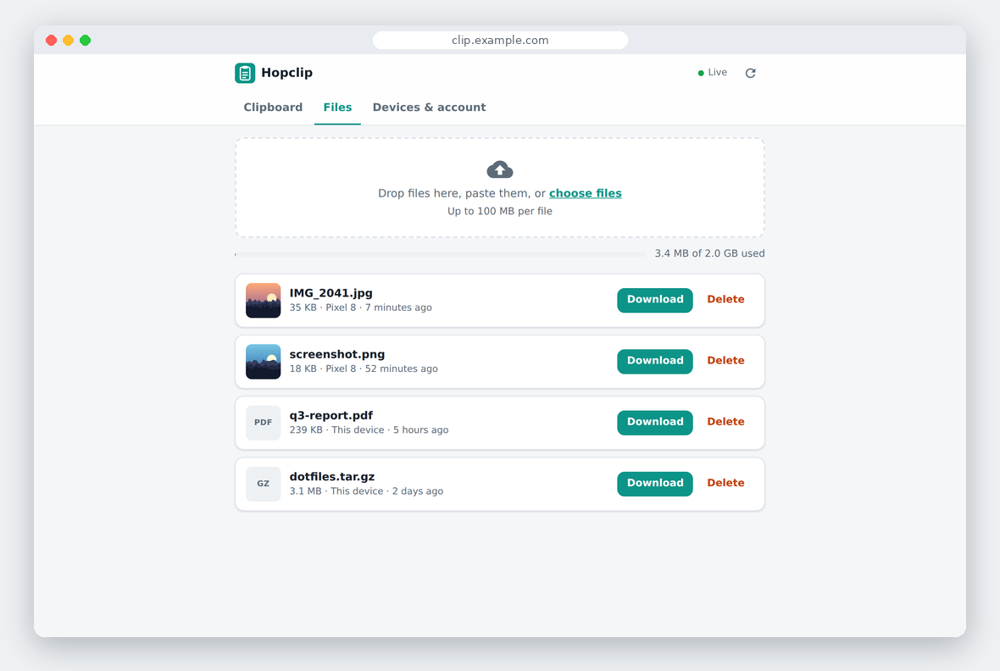
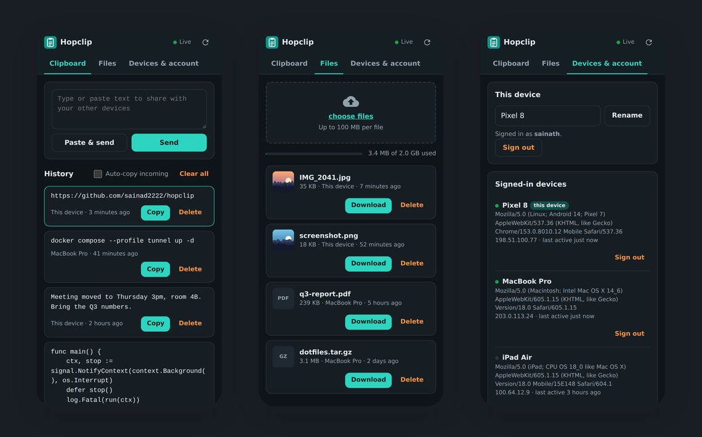
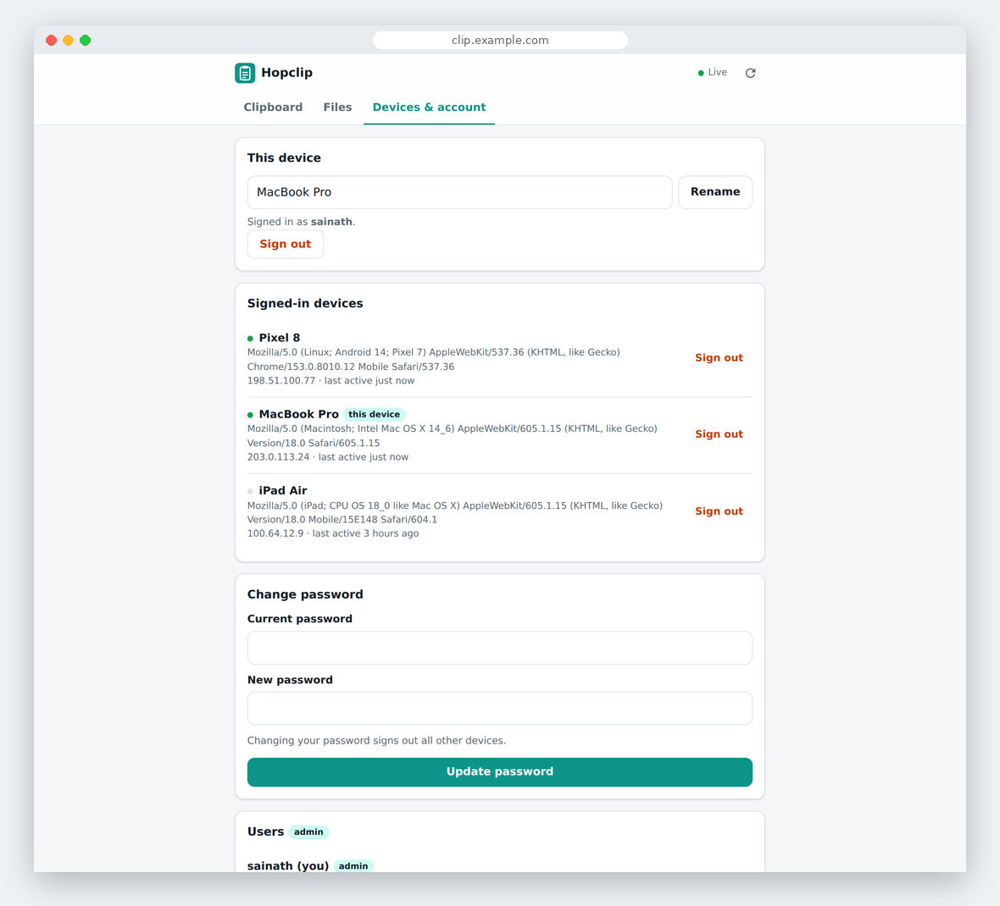

<p align="center">
  
</p>

<h1 align="center">Hopclip</h1>

<p align="center">
  A self-hosted clipboard and file drop for all your devices.<br>
  Copy on your laptop, paste on your phone. No apps, no pairing, one container.
</p>

<p align="center">
  <a href="go.mod"></a>
  <a href="https://github.com/sainad2222/hopclip/pkgs/container/hopclip"></a>
  <a href="LICENSE"></a>
</p>

<p align="center">
  
</p>

## Features

| | |
| --- | --- |
| 📋 **Live clipboard** | Send text from any device; every other signed-in device shows it within milliseconds. History is kept. |
| 📁 **File drop** | Drag, pick or paste files. Upload progress, image previews, resumable downloads. |
| 📱 **Any device** | It is a web page. Works on iOS, Android, Windows, macOS, Linux. Installable as a PWA. |
| 🔌 **Zero pairing** | Sign in and you are connected. Devices talk through your server, never to each other. |
| 👥 **Multi-user** | Separate, isolated accounts. Admin UI and CLI for user management. |
| 🔒 **Secure by default** | argon2id, `__Host-` cookies, CSRF tokens, strict CSP, rate-limited login, per-device sign-out. |
| 🪶 **Tiny** | 22 MB image, ~60 MB RAM, SQLite + a folder. Runs happily on a free Oracle Cloud arm64 VM. |

## Quick start

```sh
git clone https://github.com/sainad2222/hopclip && cd hopclip
cp .env.example .env          # set ADMIN_PASSWORD and TUNNEL_TOKEN
docker compose --profile tunnel up -d --build
```

Open your tunnel hostname, sign in, done. Repeat the sign-in on every device.

> [!TIP]
> No domain? Get a free subdomain from [DuckDNS](https://www.duckdns.org) and use the Caddy profile instead:
> `docker compose --profile caddy up -d --build`.
> See the **[deployment guide](docs/deployment.md)** for Caddy, nginx, Oracle Cloud firewall rules, backups and running without Docker.

## How it works



Every signed-in browser keeps one [Server-Sent Events](https://developer.mozilla.org/docs/Web/API/Server-sent_events) stream open. A change is a normal HTTPS request; the server stores it and fans it out to that user's other streams.



## Screenshots

<table>
  <tr>
    <td width="50%"></td>
    <td width="50%"></td>
  </tr>
  <tr>
    <td align="center">Clipboard history</td>
    <td align="center">Files with previews and quota</td>
  </tr>
</table>

<p align="center"></p>

<p align="center"><br>Every signed-in device, who is online, one-click sign-out</p>

## Usage

| Want to... | Do this |
| --- | --- |
| Send text | Type or paste in the box, press **Send** or <kbd>Ctrl</kbd>+<kbd>Enter</kbd> |
| Send your clipboard in one tap | **Paste & send** |
| Send from a desktop without clicking | Press <kbd>Ctrl</kbd>+<kbd>V</kbd> anywhere on the page |
| Receive text | It appears at the top on every device. Tap **Copy**, or enable **Auto-copy incoming** |
| Share a file | Drop it on the page, paste it, or **choose files** |
| Kick a lost phone | **Devices & account** → **Sign out** next to it |

## Configuration

Everything is an environment variable in `.env`. The full annotated list is in [`.env.example`](.env.example).

| Variable | Default | |
| --- | --- | --- |
| `ADMIN_USERNAME` / `ADMIN_PASSWORD` | | First admin, created once on first start |
| `TUNNEL_TOKEN` | | Cloudflare Tunnel token (`tunnel` profile) |
| `DOMAIN` | | Public hostname (`caddy` profile) |
| `CLIENT_IP_HEADER` | `Cf-Connecting-Ip` | Real client IP header from your proxy |
| `MAX_UPLOAD_MB` | `100` | Largest single file |
| `USER_QUOTA_MB` | `2048` | File storage per user, `0` = unlimited |
| `MAX_CLIP_KB` | `256` | Largest clipboard entry |
| `CLIP_HISTORY_LIMIT` | `200` | Clips kept per user |
| `FILE_RETENTION_DAYS` / `CLIP_RETENTION_DAYS` | `0` | Auto-delete after N days, `0` = never |
| `SESSION_TTL` | `720h` | Idle session lifetime, extended on use |
| `LOGIN_MAX_ATTEMPTS` / `LOGIN_WINDOW` | `10` / `15m` | Login lockout |

## Managing users

```console
$ docker compose exec app hopclip user add alice
New password:
Repeat password:
created user alice (admin=false)

$ docker compose exec app hopclip user list
ID  USERNAME  ADMIN  CREATED
1   admin     true   2026-10-05 16:00:01
2   alice     false  2026-10-05 16:04:12

$ docker compose exec app hopclip user passwd alice    # also signs alice out everywhere
$ docker compose exec app hopclip user admin alice on
$ docker compose exec app hopclip user del alice       # removes her clips and files too
```

Admins can do the same from **Devices & account → Users** in the web UI.

## API

The UI is a thin client over a small JSON API, so scripts can use it too:

```sh
# sign in, keep the cookie, grab the CSRF token
curl -c jar -H 'Content-Type: application/json' \
  -d '{"username":"alice","password":"...","device_name":"build server"}' \
  https://clip.example.com/api/login | jq -r .csrf_token > csrf

# push the output of a command to all your devices
curl -b jar -H "X-CSRF-Token: $(cat csrf)" -H 'Content-Type: application/json' \
  -d "{\"content\": $(git rev-parse HEAD | jq -Rs .)}" https://clip.example.com/api/clips

# upload a file
curl -b jar -H "X-CSRF-Token: $(cat csrf)" -H 'Content-Type: application/pdf' --data-binary @report.pdf \
  "https://clip.example.com/api/files?name=report.pdf"

# watch the live event stream
curl -N -b jar https://clip.example.com/api/events
```

Full reference: **[docs/api.md](docs/api.md)**.

## FAQ

<details>
<summary><b>Can it sync my clipboard automatically, like ClipCascade's desktop app?</b></summary>

Not from a web page. Browsers do not let a page read the clipboard in the background, and only allow writes while the page is focused. Sending takes one tap (**Paste & send**) or a <kbd>Ctrl</kbd>+<kbd>V</kbd>; receiving is automatic, and **Auto-copy incoming** copies new clips while the tab is in front. In exchange there is nothing to install on any device.
</details>

<details>
<summary><b>Why SSE and not WebSockets?</b></summary>

Updates only flow server → browser; sending is a normal POST. SSE does exactly that over plain HTTP, reconnects on its own, needs no extra library, and passes through Cloudflare, Caddy and nginx without special configuration.
</details>

<details>
<summary><b>Is my data encrypted?</b></summary>

In transit, yes (HTTPS). At rest, clips and files sit unencrypted on your server's disk, like most self-hosted apps. Use disk or volume encryption if your threat model needs it. See [SECURITY.md](SECURITY.md).
</details>

<details>
<summary><b>Why the 100 MB default upload limit?</b></summary>

Cloudflare's free plan rejects request bodies over 100 MB. With Caddy or nginx you can raise `MAX_UPLOAD_MB` freely.
</details>

## Development

```sh
make run      # http://localhost:8080, user admin / devpassword
make test     # go test -race ./...
make lint     # gofmt, go vet, staticcheck
```

No Node, no bundler: the UI is plain HTML, CSS and JS embedded into the binary. See [CONTRIBUTING.md](CONTRIBUTING.md) for the project layout and conventions.

## License

[MIT](LICENSE)
