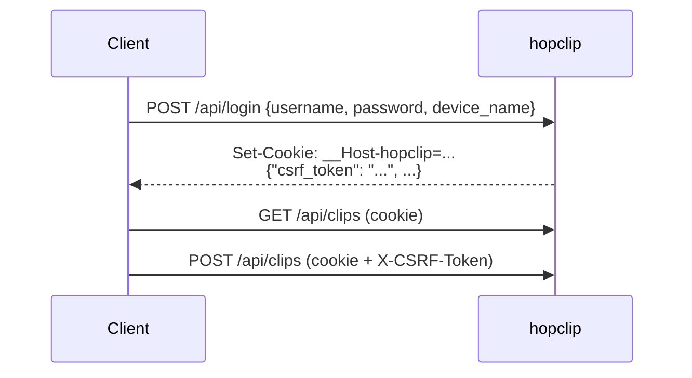

# API

Everything the web UI does goes through this JSON API.

## Authentication



- The session cookie is `HttpOnly`, `Secure`, `SameSite=Strict`. With `COOKIE_SECURE=false` its name is `hopclip` instead of `__Host-hopclip`.
- Every non-GET request needs `X-CSRF-Token`, from the login response or `GET /api/me`.
- JSON bodies need `Content-Type: application/json`.
- Errors are `{"error": "message"}` with a matching HTTP status.

## Endpoints

### Session

| Method | Path | Body | Response |
| --- | --- | --- | --- |
| `POST` | `/api/login` | `{username, password, device_name?}` | `200` [me](#me) |
| `POST` | `/api/logout` | | `204` |
| `GET` | `/api/me` | | `200` [me](#me) |
| `POST` | `/api/password` | `{current_password, new_password}` | `200 {revoked_sessions}` |
| `GET` | `/api/sessions` | | `200` list of devices |
| `PATCH` | `/api/sessions/{id}` | `{device_name}` | `200` |
| `DELETE` | `/api/sessions/{id}` | | `204`, signs that device out |

### Clips

| Method | Path | Body | Response |
| --- | --- | --- | --- |
| `GET` | `/api/clips?limit=N` | | `200` newest first |
| `POST` | `/api/clips` | `{content}` | `201` clip |
| `DELETE` | `/api/clips/{id}` | | `204` |
| `DELETE` | `/api/clips` | | `204`, clears history |

### Files

| Method | Path | Body | Response |
| --- | --- | --- | --- |
| `GET` | `/api/files` | | `200` newest first |
| `POST` | `/api/files?name=NAME` | raw bytes, `Content-Type` = file type | `201` file |
| `GET` | `/api/files/{id}` | | file as attachment, supports `Range` |
| `GET` | `/api/files/{id}?inline=1` | | inline, only when `previewable` is true |
| `DELETE` | `/api/files/{id}` | | `204` |

Uploads over the limit or quota get `413`.

### Admin

Requires an admin account.

| Method | Path | Body | Response |
| --- | --- | --- | --- |
| `GET` | `/api/admin/users` | | `200` users with `used_bytes` |
| `POST` | `/api/admin/users` | `{username, password, is_admin?}` | `201` |
| `PATCH` | `/api/admin/users/{id}` | `{password?, is_admin?}` | `200` |
| `DELETE` | `/api/admin/users/{id}` | | `204` |

### Other

| Method | Path | |
| --- | --- | --- |
| `GET` | `/api/events` | Server-Sent Events stream, see below |
| `GET` | `/healthz` | `200 {"status":"ok"}` when the database is reachable |

## Objects

### me

```json
{
  "user": { "id": 1, "username": "alice", "is_admin": false, "created_at": 1791215796522 },
  "session_id": "432672e04ef525f2546e6839",
  "device_name": "MacBook Pro",
  "csrf_token": "91d05aeff4df0acf9a9a2554cfc048dbaec67c4ac3d56a81",
  "limits": {
    "max_upload_bytes": 104857600,
    "user_quota_bytes": 2147483648,
    "max_clip_bytes": 262144,
    "clip_history_limit": 200
  },
  "used_bytes": 3407872
}
```

### clip

```json
{
  "id": 42,
  "content": "Flight BA 286, gate 22B, boarding 18:40",
  "device_name": "MacBook Pro",
  "session_id": "432672e04ef525f2546e6839",
  "created_at": 1791215798242
}
```

### file

```json
{
  "id": "f4ca5f6a4bf8c85fb9a2a1b6e866d35e",
  "name": "IMG_2041.jpg",
  "size": 35460,
  "content_type": "image/jpeg",
  "device_name": "Pixel 8",
  "session_id": "10737858ef5e3f2ac96bac34",
  "created_at": 1791215798283,
  "previewable": true
}
```

Timestamps are Unix milliseconds.

## Events

`GET /api/events` returns `text/event-stream`. Each message is one JSON object on a `data:` line. The first is always `hello`; a `: ping` comment follows every 25 seconds.

```text
retry: 3000

data: {"type":"hello","data":{"session_id":"432672e04ef525f2546e6839"}}

data: {"type":"clip","data":{"id":42,"content":"Flight BA 286, gate 22B",...},"from":"432672e04ef525f2546e6839"}

: ping
```

| `type` | `data` | When |
| --- | --- | --- |
| `hello` | `{session_id}` | stream opened; refetch lists now to catch anything missed |
| `clip` | clip | a clip was added |
| `clip_deleted` | `{id}` | a clip was deleted |
| `clips_cleared` | | history cleared |
| `file` | file | a file was uploaded |
| `file_deleted` | `{id}` | a file was deleted or expired |
| `devices_changed` | | a device was renamed or signed out |
| `resync` | | refetch everything (after retention cleanup) |

`from` is the session that caused the event, so a device can recognise its own changes. The stream closes when the session is signed out or expires.

## Examples

```sh
B=https://clip.example.com

curl -sc jar -H 'Content-Type: application/json' \
  -d '{"username":"alice","password":"...","device_name":"build server"}' \
  $B/api/login | jq -r .csrf_token > csrf
H=(-b jar -H "X-CSRF-Token: $(cat csrf)")

# send text
curl "${H[@]}" -H 'Content-Type: application/json' -d '{"content":"hello from curl"}' $B/api/clips

# latest clip as plain text
curl -s -b jar "$B/api/clips?limit=1" | jq -r '.[0].content'

# upload and download
curl "${H[@]}" -H 'Content-Type: image/png' --data-binary @shot.png "$B/api/files?name=shot.png"
curl -s -b jar $B/api/files | jq -r '.[0].id' | xargs -I{} curl -b jar -OJ $B/api/files/{}

# follow events
curl -N -b jar $B/api/events
```
