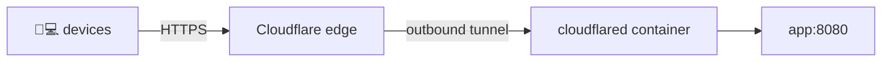

# Deployment

Hopclip is one container that listens on plain HTTP. Put a front door in front of it for HTTPS:

| | Cloudflare Tunnel **(recommended)** | Caddy | Your own nginx |
| --- | --- | --- | --- |
| Inbound ports to open | none | 80, 443 | 80, 443 |
| TLS certificates | Cloudflare | automatic (Let's Encrypt) | you (certbot) |
| Hides server IP | ✅ | ❌ | ❌ |
| Upload limit | 100 MB (free plan) | none | `client_max_body_size` |
| Needs | domain on Cloudflare | any domain / DuckDNS | existing nginx |

- [Prerequisites](#prerequisites)
- [Option A: Cloudflare Tunnel](#option-a-cloudflare-tunnel-recommended)
- [Option B: Caddy](#option-b-caddy)
- [Option C: existing nginx](#option-c-existing-nginx)
- [Oracle Cloud notes](#oracle-cloud-notes)
- [Updating](#updating)
- [Backup and restore](#backup-and-restore)
- [Without Docker](#without-docker)

## Prerequisites

Docker with the Compose plugin:

```sh
# Ubuntu / Debian
sudo apt install -y docker.io docker-compose-v2 docker-buildx
sudo usermod -aG docker $USER    # then log out and back in
```

```sh
git clone https://github.com/sainad2222/hopclip && cd hopclip
cp .env.example .env
```

Set `ADMIN_PASSWORD` (8+ characters) in `.env`. That account is created on first start.

## Option A: Cloudflare Tunnel (recommended)



The tunnel is an outbound connection from your server, so no ports are opened and your IP stays private.

1. **Cloudflare dashboard → Zero Trust → Networks → Tunnels → Create a tunnel** → *Cloudflared*. Copy the token.
2. **Public hostname** tab → add:

   | Subdomain | Domain | Service |
   | --- | --- | --- |
   | `clip` | `example.com` | `HTTP` · `app:8080` |

3. `.env`:

   ```ini
   TUNNEL_TOKEN=eyJhIjoi...
   CLIENT_IP_HEADER=Cf-Connecting-Ip
   MAX_UPLOAD_MB=100
   ```

4. Start:

   ```sh
   docker compose --profile tunnel up -d --build
   ```

Open `https://clip.example.com`.

## Option B: Caddy

1. DNS: an `A` record `clip.example.com → <server public IP>`. No domain? A free [DuckDNS](https://www.duckdns.org) subdomain works: create one, set its IP to the server's public IP, and use it as `DOMAIN` (e.g. `yourname.duckdns.org`).
2. Open TCP 80 and 443 (and UDP 443 for HTTP/3) in your cloud firewall. On Oracle Cloud see [below](#oracle-cloud-notes).
3. `.env`:

   ```ini
   DOMAIN=clip.example.com
   CLIENT_IP_HEADER=X-Forwarded-For
   ```

4. Start:

   ```sh
   docker compose --profile caddy up -d --build
   ```

Caddy fetches and renews the certificate itself. The config is [`deploy/Caddyfile`](../deploy/Caddyfile).

## Option C: existing nginx

`docker compose up -d --build` publishes the app on `127.0.0.1:8080` only. Set `CLIENT_IP_HEADER=X-Forwarded-For` and add:

```nginx
server {
    listen 443 ssl;
    http2 on;
    server_name clip.example.com;
    # ssl_certificate / ssl_certificate_key from certbot

    client_max_body_size 100m;          # >= MAX_UPLOAD_MB

    location / {
        proxy_pass http://127.0.0.1:8080;
        proxy_set_header Host $host;
        proxy_set_header X-Forwarded-For $remote_addr;   # overwrite, never append
        proxy_http_version 1.1;
        proxy_buffering off;            # live events
        proxy_request_buffering off;    # stream uploads, accurate progress
        proxy_read_timeout 1h;
    }
}
```

## Oracle Cloud notes

Only needed for Caddy or nginx; the tunnel needs no inbound rules.

1. **Console → Networking → Virtual Cloud Networks → your VCN → Security Lists → Default** → add ingress rules from `0.0.0.0/0` for TCP 80, TCP 443 and UDP 443.
2. Oracle's Ubuntu images also block ports in iptables:

   ```sh
   sudo iptables -I INPUT 6 -m state --state NEW -p tcp --dport 80  -j ACCEPT
   sudo iptables -I INPUT 6 -m state --state NEW -p tcp --dport 443 -j ACCEPT
   sudo iptables -I INPUT 6 -m state --state NEW -p udp --dport 443 -j ACCEPT
   sudo netfilter-persistent save
   ```

The Ampere (arm64) free-tier shapes are fully supported; the image is built for `linux/amd64` and `linux/arm64`.

## Why `CLIENT_IP_HEADER` matters

Behind a proxy, every request reaches the app from the proxy's address. The app needs the real client IP for two things: login rate limiting, and the IP shown in the device list. If the header is wrong, all visitors look like one address, and one person's failed logins can lock everyone out for 15 minutes.

| Front door | `CLIENT_IP_HEADER` |
| --- | --- |
| Cloudflare Tunnel | `Cf-Connecting-Ip` |
| Caddy, nginx | `X-Forwarded-For` |
| Nothing (direct) | *(empty)* |

## Updating

```sh
git pull
docker compose --profile tunnel up -d --build    # or your profile
```

Database migrations run automatically on start.

## Backup and restore

All state is in the `hopclip_data` volume: `hopclip.db` plus a `files/` folder.

```sh
# backup
docker compose stop app
docker run --rm -v hopclip_data:/data -v "$PWD":/backup alpine \
  tar czf /backup/hopclip-$(date +%F).tgz -C /data .
docker compose start app

# restore
docker compose stop app
docker run --rm -v hopclip_data:/data -v "$PWD":/backup alpine \
  sh -c 'rm -rf /data/* && tar xzf /backup/hopclip-2026-10-05.tgz -C /data && chown -R 65532:65532 /data'
docker compose start app
```

## Without Docker

Download a binary from [Releases](https://github.com/sainad2222/hopclip/releases) (or `make build`) and run it under systemd behind your proxy:

```ini
# /etc/systemd/system/hopclip.service
[Unit]
Description=Hopclip
After=network-online.target

[Service]
ExecStart=/usr/local/bin/hopclip serve
Environment=LISTEN_ADDR=127.0.0.1:8080
Environment=DATA_DIR=/var/lib/hopclip
Environment=CLIENT_IP_HEADER=X-Forwarded-For
EnvironmentFile=-/etc/hopclip.env
User=hopclip
StateDirectory=hopclip
NoNewPrivileges=yes
ProtectSystem=strict
ProtectHome=yes
PrivateTmp=yes
Restart=on-failure

[Install]
WantedBy=multi-user.target
```

```sh
sudo useradd --system --home-dir /var/lib/hopclip --shell /usr/sbin/nologin hopclip
sudo systemctl enable --now hopclip
sudo -u hopclip env DATA_DIR=/var/lib/hopclip hopclip user add me -admin
```
